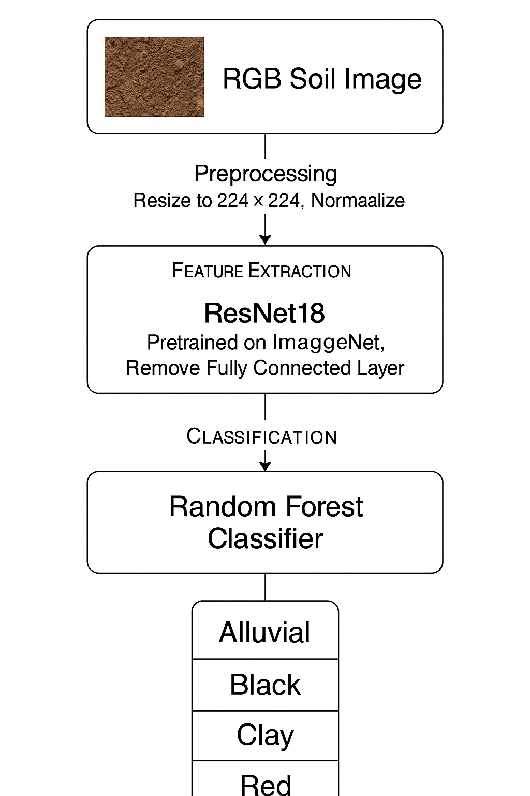

# 🌱 Soil Image Classification – Challenge 1

Welcome to my solution for Challenge 1 of the Soil Classification Competition on Kaggle 2025. In this notebook-driven project, our goal was to classify soil images into four distinct categories based on visual characteristics:

- **Alluvial**  
- **Black**  
- **Clay**  
- **Red**  

We combine a deep‐learning feature extractor (ResNet-18) with a classical Random Forest classifier to build a robust multi‐class image classifier.

---

## 🚀 Final Results

| Metric                              | Value   |
|-------------------------------------|--------:|
| 🏁 Private Leaderboard Rank          | 40      |
| • Avg CV Macro F1-Score              | 0.9446  |
| • Best Fold (Fold 5) F1-Score        | 0.9705  |
| • Public LB Score                    | 1.000   |

🏆 **Submission Strategy:** ResNet18 (ImageNet-pretrained) + Random Forest Ensemble learning

---

## 🔍 Problem Statement

Build a robust classifier that can distinguish between soil types using only RGB images. Key challenges:

- Visual similarity & texture variations  
- Lighting and background noise  
- Class imbalance  

---

## 🗺️ Pipeline Overview
Below is a vertical diagram illustrating the main structure of the classification pipeline:



## 📦 Dataset

Download from Kaggle:  
https://www.kaggle.com/competitions/soil-classification/data

Unpack into your project directory as:

```
challenge-1/
└── data/
    ├── train/
    │   ├── image_1.jpg
    │   ├── image_2.jpg
    │   └── ...
    ├── test/
    │   ├── image_101.jpg
    │   ├── image_102.jpg
    │   └── ...
    ├── train_labels.csv
    └── test_ids.csv
```

---

## 🛠️ Setup

1. **Clone the repository**
   ```cmd
   git clone https://github.com/sanskaryo/Soil_classification_project_annam.git
   cd Soil_classification_project_annam/challenge-1
   ```

2. **Install dependencies**
   ```cmd
   pip install -r requirements.txt
   ```

---

## 🔄 Preprocess Data

Use the provided helper to resize and normalize all images:

```python
from src.preprocessing import preprocess_images

# Resize train and test images to 224×224
preprocess_images(
    train_dir='data/train',
    img_size=(224, 224),
    out_dir='data/train_preprocessed'
)
preprocess_images(
    train_dir='data/test',
    img_size=(224, 224),
    out_dir='data/test_preprocessed'
)
```

---

## 📖 Training

1. Open and run:  
   ```markdown
   notebooks/training.ipynb
   ```
2. This notebook will:
   - Load and augment images  
   - Extract features via ResNet-18  
   - Train & validate a Random Forest (5-fold CV)  
   - Save `models/final_model.pkl` and `models/label_classes.npy`

---

## 🔮 Inference

1. Open and run:  
   ```markdown
   notebooks/inference.ipynb
   ```
2. It will:
   - Reload the saved model & label classes  
   - Extract features on the test set  
   - Generate `outputs/submission.csv`

---

## 🚀 One-Click Run

To run preprocessing, training & inference in one go (with charts), open and execute:
```
src/combined-prePost-notebook_with_charts.ipynb
```
A final `submission.csv` will be generated under `outputs/`.

---

## 📁 Project Structure

```
challenge-1/
├── data/                          # Raw and preprocessed images + CSVs
├── notebooks/
│   ├── training.ipynb            # End-to-end training pipeline
│   ├── inference.ipynb           # Inference & submission generation
│   └── combined-prePost-notebook_with_charts.ipynb
├── src/
│   ├── preprocessing.py          # Image transforms & feature extraction
│   ├── postprocessing.py         # Submission utilities
│   └── utils.py
├── models/
│   ├── final_model.pkl           # Trained Random Forest model
│   └── label_classes.npy         # Label encoder classes
├── outputs/
│   ├── submission.csv            # Final submission file
│   └── metrics.json              # CV and evaluation logs
├── requirements.txt              # Python dependencies
└── README.md                     # This file
```

---

## --- Fold 5 ---
Fold 5 F1 Score: 0.9705

```text
               precision    recall  f1-score   support

Alluvial soil       0.97      0.97      0.97       105
   Black Soil       1.00      0.93      0.97        46
    Clay soil       0.95      0.97      0.96        40
     Red soil       0.96      1.00      0.98        53

     accuracy                           0.97       244
    macro avg       0.97      0.97      0.97       244
 weighted avg       0.97      0.97      0.97       244
```

✅ Average F1 Score: 0.9446

---

## 🎓 Lessons Learned

- **Hybrid approach** (deep features + Random Forest) excels in low-data settings
- **Macro F1** is crucial for imbalanced classes
- **Visual inspection** of misclassifications guides augmentation strategies

---

## 👤 About Me

**Sanskar Khandelwal**  
- Kaggle: [sankhuz](https://www.kaggle.com/sankhuz)  
- Team: TheLastTransformer 🚀

Feel free to ⭐ the repo and share feedback!


