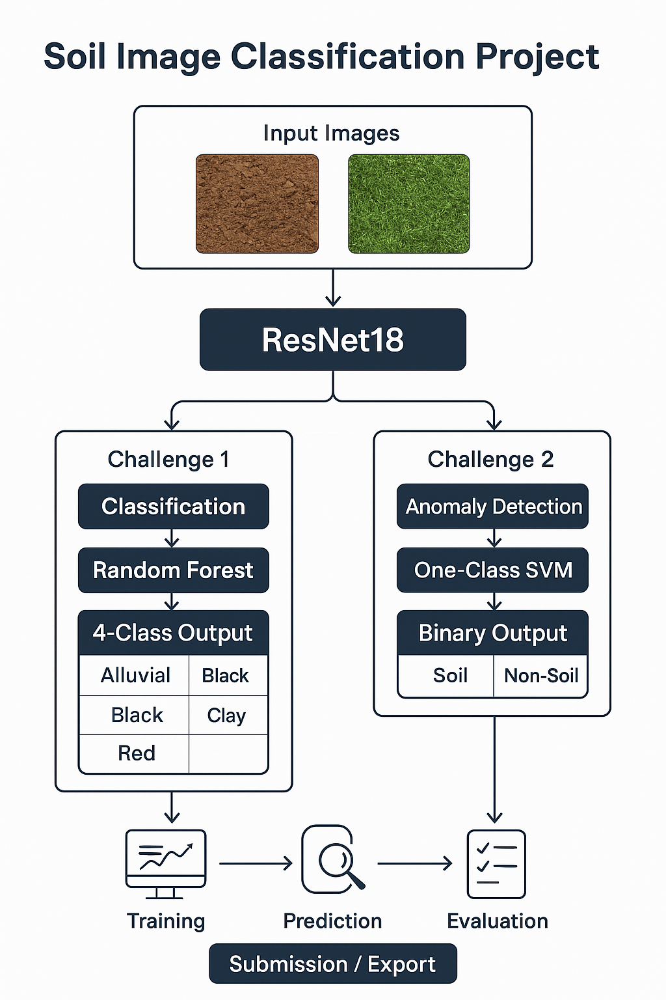

<h1>🏆 Soil Classification Challenge Submission</h1>

<p>This project was developed as part of the Hackathon + Internship opportunity organized by IIT Ropar and Annam.ai. I, Sanskar Khandelwal, participated solo and built ML models for classifying soil types from images. This task aimed to automate soil-type classification to assist in agriculture and sustainability using AI. Special thanks to <strong>Sudarshan Iyengar</strong>, <strong>Madhur Tharuja</strong>, and the entire <strong>Annam AI & IIT Ropar</strong> team for organizing this opportunity!</p>

<p align="center">
  
</p>

<p>Below is the detailed overview of my project, approach, and findings.</p>

---

## 👤 Participant Details

- **Name:** Sanskar Khandelwal  
- **Team Name:** TheLastTransformer
- **Year:** 2nd Year B.Tech CSE 
- **University:** GLA University, Mathura  
- **Email:** sanskar.khandelwal_cs.aiml23@gla.ac.in  
- **Radhe Radhe! 🙏**  

> **Note:** Apologies for minor errors. Initially the entire pipeline was in a single notebook, which has now been refactored into this structured repository.

---

## 📊 Leaderboard Performance

| Task                                         | Score  | Public Rank | Private Rank |
|----------------------------------------------|--------|-------------|--------------|
| Task 1 - Binary Soil Classification          | 1.000  | 56          | 40           |
| Task 2 - Multi-Class Soil Image Classification | 0.8989 | 37          | 48           |


---

## 🗂️ Project Structure

```bash
.
├── challenge-1/             # Binary classification resources
│   ├── notebooks/           # Notebooks & scripts for Task 1
│   └── README.md            # Detailed Challenge 1 instructions
├── challenge2/              # Multi-class classification resources
│   ├── notebooks/           # Notebooks & scripts for Task 2
│   └── README.md            # Detailed Challenge 2 instructions
├── notebooks/               # Legacy notebooks (training & inference)
│   ├── training.ipynb
│   └── inference.ipynb
├── models/                  # Saved model weights
├── data/                    # (Not included) -- download manually
├── requirements.txt         # Python dependencies
├── download.sh              # Dataset download script
├── submission.csv           # Final submission predictions
└── README.md                # This file
```

> **Note:** Data is excluded due to size; download manually. Large files are ignored via `.gitignore`.

---

## 🧠 Approach Overview

### 🔹 Task Objective

Classify soil images into one of the four categories:  
- Alluvial  
- Black  
- Clay  
- Red

### 🔹 Modeling Pipeline

- **Model Architecture:** Transfer learning using pretrained CNNs like ResNet-18, EfficientNet-B0
- **Training Strategy:**  
  - Image normalization, resizing to 224x224  
  - Stratified train-validation split  
  - Data augmentation (flip, rotate, brightness)  
  - Cross-validation for robustness  
- **Inference:**  
 
  - Ensemble averaging for stability  

---

## 🛠️ Tools & Technologies

- Python 🐍  
- PyTorch / Torchvision  
- Scikit-learn  
- OpenCV  
- Matplotlib / Seaborn  
- Jupyter Notebooks

---
---

## 📚 Additional Resources
- **Transcript:** https://drive.google.com/file/d/1eF-W1mjo6NA-FzupMtfFTC-9WZPRY5B3/view?usp=drive_link
- **Video Explanation:** https://drive.google.com/drive/folders/1pHEEjiZYHQqzNbf4oZW7LKfg8oL2sz5W?usp=drive_link

---
## 📓 Notebooks Breakdown

### `training.ipynb`

- Loads and preprocesses image dataset
- Applies augmentations and normalizations
- Extracts features using pretrained CNNs (e.g., ResNet18)
- Trains classifiers (e.g., fully connected layers or Random Forests)
- Plots metrics and saves trained models

### `inference.ipynb`

- Loads saved models and test data
- Applies albumenations (horizontal/vertical flips, brightness)
- Generates predictions
- Outputs `submission.csv` as per competition format

---

## 📈 Evaluation Metric

- **Metric Used:** Minimum F1-score across all 4 classes  
- This ensures balanced performance — even the lowest performing class matters!

```python
from sklearn.metrics import f1_score
score = min([
    f1_score(y_true, y_pred, average=None)[i] for i in range(4)
])
```

---

## ⚙ Setup Instructions

1. **Clone the repository**
```bash
git clone https://github.com/yourusername/soil-classification
cd soil-classification
```

2. **Install dependencies**
```bash
pip install -r requirements.txt
```

3. **Download the dataset**
```bash
bash download.sh
```

4. **Run notebooks**
- `notebooks/training.ipynb` → train models  
- `notebooks/inference.ipynb` → generate `submission.csv`

---

## ⚡ Why This Approach Works

✅ Combines deep learning feature extraction with classical ML models  
✅ Balanced F1-score strategy ensures no class is ignored  
✅ Simple yet effective – reproducible and scalable  

---

## 💬 Reflections

I participated solo in this challenge and acknowledge that my submission may not compete head-to-head with full teams, but I gave my best and learned a lot! Looking forward to the next rounds if selected. Jai Shree Krishna 🙏

---

## 🤝 Acknowledgements

- Organizers: Annam.ai, IIT Ropar  
- Pretrained models: Resnet 18  
- Community support and dataset providers  
- Inspiration from top teams and peers in this domain

---

## 👨‍💻 Author

**Sanskar Khandelwal**  
Email: `sanskar.khandelwal_cs.aiml23@gla.ac.in`  
University: GLA University, Mathura  
Connect with me for ML, AI, or vision projects! 🚀
kaggle username - sankhuz

---

## 📬 Contact

If any reviewer or peer wants to discuss this submission or connect:
- **Email:** sanskar.khandelwal_cs.aiml23@gla.ac.in

---

## ⚖️ License

This project is submitted as part of a Hackathon and is intended for academic and educational review. Please contact me for further use.


<p align="center"><strong>🚜 Towards Sustainable AI-Powered Agriculture! 🚀</strong></p>
